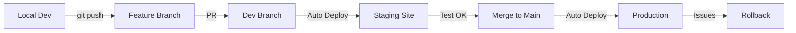

# Development Workflow Pipeline

## 🎯 The Professional Git Flow

### Branch Structure:
```
main (production) → municipal-inquiry-system.vercel.app
  ↑
  └── dev (staging) → municipal-inquiry-system-dev.vercel.app
        ↑
        └── feature/button-fix (local development)
```

## 📋 Step-by-Step Setup

### 1. Create Development Branch
```bash
# Create and switch to dev branch
git checkout -b dev

# Push dev branch to GitHub
git push -u origin dev
```

### 2. Configure Vercel for Multi-Environment

**In Vercel Dashboard:**

1. Go to Settings → Domains
2. Add custom domain for dev branch:
   - `dev-municipal.vercel.app` or similar

3. Go to Settings → Environment Variables
4. Set different values per environment:
   - Production: Real data, real API keys
   - Preview/Development: Test data, test API keys

### 3. Development Workflow

#### A. Local Development
```bash
# Always work on dev branch locally
git checkout dev

# Make your changes
# Test locally at http://localhost:8009

# When happy, commit
git add .
git commit -m "feat: implement new feature"
```

#### B. Deploy to Staging
```bash
# Push to dev branch
git push origin dev

# Vercel auto-deploys to staging URL
# Test at: municipal-inquiry-system-git-dev.vercel.app
```

#### C. Deploy to Production
```bash
# After testing on staging, merge to main
git checkout main
git merge dev
git push origin main

# Vercel auto-deploys to production
# Live at: municipal-inquiry-system.vercel.app
```

## 🔧 Environment Variables Strategy

### Development (.env.local)
```env
NODE_ENV=development
ADMIN_PASSWORD=test123
OPENAI_API_KEY=sk-test-...
SPREADSHEET_ID=test_sheet_id
```

### Staging (Vercel dev branch)
```env
NODE_ENV=staging
ADMIN_PASSWORD=staging456
OPENAI_API_KEY=sk-staging-...
SPREADSHEET_ID=staging_sheet_id
```

### Production (Vercel main branch)
```env
NODE_ENV=production
ADMIN_PASSWORD=strong_production_password
OPENAI_API_KEY=sk-prod-...
SPREADSHEET_ID=production_sheet_id
```

## 🚀 Quick Commands

### Start New Feature
```bash
git checkout dev
git pull origin dev
git checkout -b feature/new-feature
# ... make changes ...
git add .
git commit -m "feat: description"
git push origin feature/new-feature
# Create PR to dev branch
```

### Deploy to Staging
```bash
git checkout dev
git merge feature/new-feature
git push origin dev
# Auto-deploys to staging
```

### Deploy to Production
```bash
git checkout main
git merge dev
git push origin main
# Auto-deploys to production
```

## 🛡️ Safety Features

### 1. Branch Protection Rules (GitHub)
- Settings → Branches
- Add rule for `main`
- Require pull request reviews
- Require status checks to pass

### 2. Vercel Deployment Protection
- Settings → Deployment Protection
- Password protect staging site
- Require approval for production

### 3. Rollback Strategy
```bash
# If production breaks
git checkout main
git revert HEAD
git push origin main
# Vercel auto-deploys previous version
```

## 📊 Current Project Status

### What We Have Now:
- ✅ Local development working
- ✅ Main branch connected to Vercel
- ⚠️ No staging environment yet
- ⚠️ Direct pushes to main

### Recommended Next Steps:
1. Create `dev` branch
2. Set up staging environment in Vercel
3. Test workflow with current fixes
4. Then push to production

## 🎭 Testing Strategy

### Local Testing
- Run all features
- Test with test data
- Check console for errors

### Staging Testing
- Test with real-like data
- Test all integrations
- Get team feedback

### Production Deployment
- Only after staging approval
- During low-traffic hours
- Monitor for 30 minutes post-deploy

## 💡 Pro Tips

1. **Never commit directly to main**
2. **Always test on staging first**
3. **Keep staging close to production**
4. **Use feature flags for gradual rollouts**
5. **Tag releases for easy rollbacks**

### Example Release Tags:
```bash
git tag -a v1.0.0 -m "Initial release"
git push origin v1.0.0
```

## 🔄 The Complete Flow

