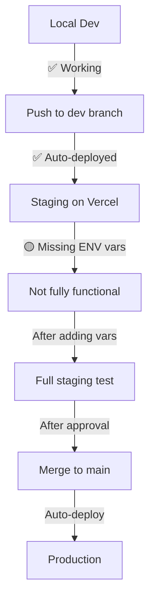

# 📊 AvTahbura Status Report
**Date:** August 14, 2025  
**Time:** 11:50 AM

## 🟢 What's Currently Running

### Local Environment (YOUR MACHINE)
| Component | Status | Details |
|-----------|--------|---------|
| **Server** | ✅ RUNNING | Port 8009 - http://localhost:8009 |
| **Branch** | ✅ dev | Correct branch for development |
| **Data** | ✅ LOADED | 6,446 records from Google Sheets |
| **Google Sheets** | ✅ WORKING | Reading and writing successfully |
| **OpenAI** | ✅ WORKING | GPT-4 generating responses |
| **All Buttons** | ✅ FIXED | Functions globally accessible |

### Remote Environments
| Environment | URL | Status | Has Latest Fixes |
|-------------|-----|--------|------------------|
| **Production** | https://municipal-inquiry-system.vercel.app | 🔴 OLD VERSION | ❌ No button fixes |
| **Staging** | https://municipal-inquiry-system-git-dev-*.vercel.app | 🟡 DEPLOYED | ✅ Has button fixes but NO ENV VARS |

## 🔑 Current Working Environment Variables

### ✅ LOCAL .env (CONFIRMED WORKING)
```env
PORT=8009
SPREADSHEET_ID=1m59UUY2ZvDg4xQjRbReF-npJy_k63wxd2pUt8HBIOn8
GOOGLE_APPLICATION_CREDENTIALS=google-credentials.json
OPENAI_API_KEY=[REDACTED - Use actual key from .env file]
SESSION_SECRET=test_secret_key_123456789
ADMIN_PASSWORD=test123
NODE_ENV=development
```

## 🚨 Critical Differences: Local vs Vercel

### Authentication Handling
| Aspect | Local | Vercel |
|--------|-------|--------|
| **Credentials** | File-based (`google-credentials.json`) | Environment variable (single-line JSON) |
| **File Check** | ✅ Works with file | ❌ No file system |
| **Loading Method** | `GOOGLE_APPLICATION_CREDENTIALS` | `GOOGLE_CREDENTIALS_JSON` |

### Why This Matters:
The server.js intelligently handles both:
```javascript
// Local: Uses file
if (process.env.GOOGLE_APPLICATION_CREDENTIALS && fs.existsSync(process.env.GOOGLE_APPLICATION_CREDENTIALS))

// Vercel: Uses JSON string
if (process.env.GOOGLE_CREDENTIALS_JSON)
```

## 🎯 Recommended Development Strategy

### BEST APPROACH: Hybrid Testing

#### 1. **Primary Development: LOCAL** ✅
**Why:** 
- Instant feedback
- Full debugging capabilities
- No deployment wait
- Console.log visibility
- File system access

**When to use:**
- Writing new features
- Fixing bugs
- Initial testing

#### 2. **Validation: STAGING** ✅
**Why:**
- Tests Vercel-specific issues
- Verifies environment variables
- Tests serverless functions
- Real deployment environment

**When to use:**
- Before production deployment
- Testing environment-specific features
- Client preview

## 📋 What Needs to Be Done

### For Staging to Work:
1. **Add Environment Variables to Vercel** (Staging)
   - Go to Vercel Dashboard
   - Select dev branch deployment
   - Add all 5 environment variables
   - Redeploy

### For Production:
1. Test thoroughly on staging
2. Merge dev → main
3. Add environment variables to production
4. Monitor deployment

## 🔄 Current Workflow Status



## 💡 Recommendations

### Immediate Actions:
1. **Keep developing locally** - Everything works perfectly
2. **Add env vars to Vercel staging** - To test deployment
3. **Don't touch production yet** - Wait until staging is perfect

### Development Flow:
```bash
# Your daily workflow
1. Work locally (dev branch) ✅
2. Test at localhost:8009 ✅
3. Push to dev for staging preview
4. Add env vars to staging (one-time)
5. Test on staging URL
6. Merge to main when ready
```

## ✅ What's Working Well

1. **Local Development** - Fully functional
2. **Git Workflow** - dev/main branches set up
3. **All Features** - Search, AI, Sheets, all buttons
4. **Code Fixes** - Button handlers fixed and committed

## 🔴 What's Not Working

1. **Staging** - Missing environment variables
2. **Production** - Old code without fixes

## 📊 Summary

**Should you work locally or on Vercel staging?**

### Answer: WORK LOCALLY
- ✅ Everything is working
- ✅ Faster development
- ✅ Better debugging
- ✅ No deployment delays

**Use staging only for:**
- Final testing before production
- Showing client preview
- Testing Vercel-specific features

---

**Next Step:** Add environment variables to Vercel staging dashboard, then test the staging URL.